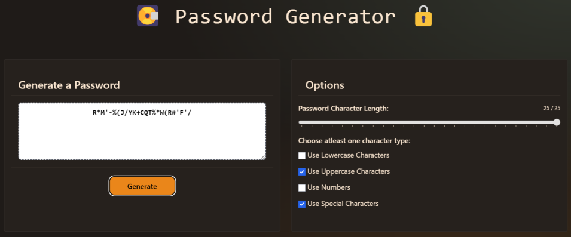

# SuprPassGen
  

## TABLE OF CONTENTS:

* [Description](#description)

* [Installation guide](#installation) 

* [Usage Info](#usage) 

* [Questions](#questions)

* [Credits](#credit)

* [License](#license)

## DESCRIPTION:

This is a simple project to keep me learning and practicing. In the beginning of my fullstack bootcamp I made a simple password generator out of HTML, CSS, and plain vanilla Javascript. And it was a fantastic exercise! I felt the right amount of challenge at the time. So at this stage of learning Rust, I wanted to attempt the same challenge. I chose Tauri so I could practice some SvelteKit on the frontend, some basic Rust on the backend, and build my first desktop app at the same time.

I am happy to say the developer experience was really great! I look forward to trying more difficult projects using these tools in the future.

## INSTALLATION:

Download the binary and install the app

## USAGE:

Choose at least one character option (passwords can be built from lowercase, uppercase, numbers, special characters, or any combination thereof) and a password length via slider and hit the generate password button.

## QUESTIONS:

If you have any questions,

you can find my GitHub here: https://github.com/Lawhornmatt

or email me here: lawhornmatt@proton.me

## CREDIT:

This project was made in 2024 by Matty Lawhorn

This is a solo-project.

## LICENSE:

This program is copyrighted under the MIT open source license.

Copyright 2024 Matthew T Lawhorn

    Permission is hereby granted, free of charge, to any person obtaining a copy of this software and associated documentation files (the "Software"), to deal in the Software without restriction, including without limitation the rights to use, copy, modify, merge, publish, distribute, sublicense, and/or sell copies of the Software, and to permit persons to whom the Software is furnished to do so, subject to the following conditions:
    
    The above copyright notice and this permission notice shall be included in all copies or substantial portions of the Software.
    
    THE SOFTWARE IS PROVIDED "AS IS", WITHOUT WARRANTY OF ANY KIND, EXPRESS OR IMPLIED, INCLUDING BUT NOT LIMITED TO THE WARRANTIES OF MERCHANTABILITY, FITNESS FOR A PARTICULAR PURPOSE AND NONINFRINGEMENT. IN NO EVENT SHALL THE AUTHORS OR COPYRIGHT HOLDERS BE LIABLE FOR ANY CLAIM, DAMAGES OR OTHER LIABILITY, WHETHER IN AN ACTION OF CONTRACT, TORT OR OTHERWISE, ARISING FROM, OUT OF OR IN CONNECTION WITH THE SOFTWARE OR THE USE OR OTHER DEALINGS IN THE SOFTWARE.

[Further license information can be found here.](https://opensource.org/licenses/MIT)